# Troubleshooting and Fixing Integration Issues
> **Important**: This is a living document that is updated by support staff as needed. It is intended to help answer FAQs and troubleshoot common problems. If you are experiencing issues not covered or resolved by this documnent, please open a support ticket here: [https://www.skillable.com/customer-support/](https://www.skillable.com/customer-support/).

## Table of Contents
- [Lab API](#lab-api)
    - [Launching Issues](#launching-issues-lab-api)
        - [Launch Sequence Diagram](#launch-sequence-diagram)
        - [Client-side errors](#client-side-errors)
        - [Error Codes](#error-codes)
    - [Scoring Issues](#scoring-issues-lab-api)
- [LTI](#lti)
    - [Deep Linking Issues](#deep-linking-issues)
        - [Deep Link Sequence Diagram](#deep-link-sequence-diagram)
        - [Common Deep Linking Issues](#common-deep-linking-issues)
    - [Launching Issues](#launching-issues-lti)
        - [LTI Launch Sequence Diagram](#lti-launch-sequence-diagram)
    - [Scoring Issues](#scoring-issues-lti)

## Lab API

### Launching Issues (Lab API)

#### Launch Sequence Diagram
Let's begin with an overview of the Lab API launch sequence. This is how events progress given there are no errors in the process. Various troublshooting steps will refer to these events:
<!--
Mermaid diagram code
    sequenceDiagram
    box rgb(84, 89, 95) Client-side
    participant User
    end
    box rgb(41, 143, 92) Server-side
    participant LMS
    participant Skillable
    end
    rect rgb(30,90,60)
    User->>LMS: Launch Lab
    end
    LMS->>Skillable: 'Launch' API request
    Skillable->>LMS: Send Connection URL
    rect rgb(30,90,60)
    destroy LMS
    LMS->>User: Redirect browser to   Connection URL
    end
    rect rgb(30,90,60)
    User->>Skillable: Connect to   Connection URL
    Skillable->> User: Send cookies containing   access tokens
    Skillable->> User: Redirect to   Lab Setup
    Note over User,Skillable: Lab is built
    Skillable->> User: Redirect to   Lab Client
    end
-->

#### Client-side errors
These are errors they users may encounter when attempting to launch a lab. They are often accompanied by [error codes](#error-codes) that are not visible to the user.

- **Access Denied** - This occurs when a user is attempting to connect to a Lab Instance (the "Connect to Connection URL" step in the [Launch Sequence Diagram](#launch-sequence-diagram)) without proper authentication. Possible causes:
    - User is trying to connect to an expired connection URL. 
    - User is trying to connect to a lab instance without obtaining an auth token fron the connection URL.
    > When the '[Launch](https://connect.skillable.com/lab/operation/Launch/)' request is sent,  the Lab API reponds with a 'Url' parameter that contains a single-use link. This link expires after being viewed once or 60 seconds (whichever comes first). Once the connection URL has expired, the platform must send a new Launch request to generate another.
- **:-\(   Sorry, something went wrong!** - This is a generic Skillable Connect error. Please [contact support](https://www.skillable.com/customer-support/) if you are experiencing this error frequently.

#### Error Codes
Error codes are recieved in the API response (the "Send Connection URL" step in the [Launch Sequence Diagram](#launch-sequence-diagram)) and are not usually visible to the end-user (unless your platform surfaces them). These will usually be found in the logs of the application sending API requests.

Common error codes and resolutions:
| Error Code | Definition | Resolution |
|---|---|---|
| 3 | Insufficient host resources | This is very uncommon, and likely caused by problems with datacenter availability. Please [contact support](https://www.skillable.com/customer-support/) if you are experiencing this error frequently. |
| 5 | API integration has too many active labs | This error is encountered when an API Consumer hits their concurrent instance limit. Possible scenarios:   - You are attempting to use a **Testing** API for production. You may need to [contact support](https://www.skillable.com/customer-support/) to convert your consumer to a **Production** configuration.   - You have significantly increased your consumption past your plan's limits. Please [contact support](https://www.skillable.com/customer-support/) if you require an increase in concurrency. |
| 7 | API integration doesn't have enough available RAM | This error is encountered when an API Consumer hits their concurrent RAM limit. Possible scenarios:   - You are attempting to use a **Testing** API for production. You may need to [contact support](https://www.skillable.com/customer-support/) to convert your consumer to a **Production** configuration.   - You have significantly increased your consumption past your plan's limits. Please [contact support](https://www.skillable.com/customer-support/) if you require an increase in concurrency. |
| 10 | User doesn't have enough available RAM | This is very uncommon, and only occurs if RAM limits have been explicitly set on a particular user. Please [contact support](https://www.skillable.com/customer-support/) if you are experiencing this error frequently.
| 20 | User's organization has too many active labs | This error is encountered when an Organization hits their concurrent instance limit. Possible scenarios:   - There is a misconfiguration on your Organization. Please [contact support](https://www.skillable.com/customer-support/) if you are experiencing this error frequently.   - You have significantly increased your consumption past your plan's limits. Please [contact support](https://www.skillable.com/customer-support/) if you require an increase in concurrency. |
| 30 | User's organization doesn't have enough available RAM | This error is encountered when an Organization hits their concurrent RAM limit. Possible scenarios:   - There is a misconfiguration on your Organization. Please [contact support](https://www.skillable.com/customer-support/) if you are experiencing this error frequently.   - You have significantly increased your consumption past your plan's limits. Please [contact support](https://www.skillable.com/customer-support/) if you require an increase in concurrency. |
| 40 | Lab profile has too many active instances | This is very uncommon, and only occurs if instance limits have been explicitly set on a particular lab.  If your organization owns the content, a lab developer may be able to resolve this issue by modifying the "**Max Active Instances**" value on the **Advanced** tab of the Lab Profile.    Otherwise, you may [contact support](https://www.skillable.com/customer-support/) if you are experiencing this error frequently. |
| 50 | Lab organization doesn't have enough available RAM | This error is encountered when an Organization hits their concurrent RAM limit. Possible scenarios:   - There is a misconfiguration on your Organization. Please [contact support](https://www.skillable.com/customer-support/) if you are experiencing this error frequently.   - You have significantly increased your consumption past your plan's limits. Please [contact support](https://www.skillable.com/customer-support/) if you require an increase in concurrency. |
| 60 | Lab organization has too many active instances | This error is encountered when an Organization hits their concurrent instance limit. Possible scenarios:   - There is a misconfiguration on your Organization. Please [contact support](https://www.skillable.com/customer-support/) if you are experiencing this error frequently.   - You have significantly increased your consumption past your plan's limits. Please [contact support](https://www.skillable.com/customer-support/) if you require an increase in concurrency. |
| 70 | Lab series has too many active instances | This is very uncommon, and only occurs if instance limits have been explicitly set on a particular Lab Series.  If your organization owns the content, a lab developer may be able to resolve this issue by modifying the "**Max Active Instances**" value on the **Limits** tab of the Lab Series.    Otherwise, you may [contact support](https://www.skillable.com/customer-support/) if you are experiencing this error frequently. |
| 80 | Lab series doesn't have enough available RAM | This is very uncommon, and only occurs if RAM limits have been explicitly set on a particular Lab Series.  If your organization owns the content, a lab developer may be able to resolve this issue by modifying the "**Max RAM Usage**" value on the **Limits** tab of the Lab Series.    Otherwise, you may [contact support](https://www.skillable.com/customer-support/) if you are experiencing this error frequently. |
| 90 | Too many labs within the specified class are currently active for another lab to be launched. | This occurs when the number of active labs has exceeded the '[maxActiveLabInstances](https://connect.skillable.com/lab/operation/GetOrCreateClass/#!in=query&path=maxActiveLabInstances&t=request)' parameter on the '[GetOrCreateClass](https://connect.skillable.com/lab/operation/GetOrCreateClass/)' request.  To update this value, you can increase the '[maxActiveLabInstances](https://connect.skillable.com/lab/operation/UpdateClass/#!in=query&path=maxActiveLabInstances&t=request)' value using the '[UpdateClass](https://connect.skillable.com/lab/operation/UpdateClass/)' request. | 
| 100 | User has launched the maximum number of instances of this lab profile. | This is very uncommon. Please [contact support](https://www.skillable.com/customer-support/) if you are experiencing this error frequently. |
| 110 | This lab is not currently available for launch via API. It is awaiting security review. | A **Cloud Security Review** is required for all labs containing cloud resources. Please [contact support](https://www.skillable.com/customer-support/) with the Lab ID to request a security review. |
| 120 | Lab instance is not in the correct state to perform the requested action. | This error occurs when attempting to modify a lab instance in an invalid way. Possible scenarios:  - Trying to '[Save](https://connect.skillable.com/lab/operation/Save/)' a lab that is already Saved.  - Trying to '[Resume](https://connect.skillable.com/lab/operation/Resume/)' a lab that is already Running.  - Trying to '[SendNotification](https://connect.skillable.com/lab/operation/SendNotification-post/)' to a lab that is Saved.   Please [contact support](https://www.skillable.com/customer-support/) if you believe an instance's state is being misreported or is stuck in a particular state.|
| 130 | This lab is not currently available for launch via API. It is awaiting security review. | A **Cloud Security Review** is required for all labs containing cloud resources. Please [contact support](https://www.skillable.com/customer-support/) with the Lab ID to request a security review. |
| 140 | The request is invalid or contains invalid parameters. | Please refer to our [Lab API Documentation](https://connect.skillable.com/lab/overview/#section/Introduction) for the correct '[Launch](https://connect.skillable.com/lab/operation/Launch/)' parameters. 
| 150 | The participant lab instance cannot be launched because the shared class environment is not currently available. | This occurs when attempting to '[Launch](https://connect.skillable.com/lab/operation/Launch/)' into a '[classId](https://connect.skillable.com/lab/operation/Launch/#!in=query&path=classId&t=request)' that contains a [shared environment](https://docs.skillable.com/guides/sl/sharedlabs.md) that isn't running. Ensure the **Lab Profile** with the **Shared Environment** role (**Advanced** tab > **Shared Class Environment** > **Role**) has been launched first. |
| 160 | The lab cannot be launched because the user is required to provide additional information. | This occurs when **Multi-Instancing** is enabled for your [API Consumer](./integration-setup-general.md#what-is-an-api-consumer) *and* a user is attempting to launch a lab of which they already have a running instance. They will need to visit the included 'Url' where they will be prompted to decide between: - Resume an existing lab.  - Launch a new instance of the same lab.| 

> If your issue was not covered or resolved by a solution here, please open a support ticket here: [https://www.skillable.com/customer-support/](https://www.skillable.com/customer-support/).

[Back to top](#troubleshooting-and-fixing-integration-issues)

### Scoring Issues (Lab API)
By default, scores are **not** automatically returned to the external platform via Lab API. A scoring workflow must be set up. There are two primary ways to retrieve lab scores via Lab API:
- [Webhooks](https://connect.skillable.com/docs/webhooks/skillable-lab-webhooks/) - Webhooks can be automatically triggered by certain stages of the lab lifecycle. [See more about webhooks here](https://connect.skillable.com/docs/webhooks/skillable-lab-webhooks/). 
- '[Details](https://connect.skillable.com/lab/operation/Details/)' or '[Result](https://connect.skillable.com/lab/operation/Result/)' request - These requests must be triggered by the external platform. 

Here are some common scenarios and their resolutions depending on your method of retriving scores:
| Issue | Webhooks | Details/Result |
|---|---|---|

## LTI

### Deep Linking Issues

#### Deep Link Sequence Diagram
Let's begin with an overview of the Deep Link sequence. This is how events progress given there are no errors in the process. Various troublshooting steps will refer to these events:
<!-- 
    Mermaid diagram code (remove backslash from 13th line):
    sequenceDiagram
    box rgb(84, 89, 95) Client-side
    participant User
    end
    box rgb(41, 143, 92) Server-side
    participant LMS
    participant Skillable
    end
    rect rgb(30,90,60)
    User->>LMS: Add new LTI Activity
    end
    LMS->>Skillable: Connection Request
    LMS--\>Skillable: Authentication   with JWT Keys
    LMS->>Skillable: Deep Link Request
    Skillable->>LMS: Send Catalog
    rect rgb(30,90,60)
    LMS->>User: Show Catalog
    User->>LMS: Select Labs
    end
    LMS->>Skillable: Request Selected Labs
    Skillable->>LMS: Send Lab Links
    rect rgb(30,90,60)
    LMS->>User: LTI Activity Added
    end
-->

#### Common Deep Linking Issues
If you setting up Deep Linking for the first time, we recommend first checking the Deep Link section in the [LTI Setup](integration-setup-lti.md#deep-linking) process.

Here are some common Deep Link issues and how to resolve them:
| Problem | Sequence Step that is Likely Failing | Resolution (Canvas) | Resolution (Moodle) | Resolution (Blackboard) |
|---|---|---|---|---|
| I don't see Skillable's LTI tool when trying to add a lab to a course. | Add new LTI Activity | This may be an issue with your tool's placement settings.  See steps 7-9 of the [Canvas LTI Setup](./integration-setup-lti.md#canvas).| This may be an issue with your LTI tool settings.  In step 4 of the [Moodle LTI Setup](./integration-setup-lti.md#moodle), ensure the following are configured correctly: - **Tool configuration usage**  - **Supports Deep Linking (Content-Item Message)** - **Content Selection URL** | This may be an issue with your tool's placement settings.  See steps 11-12 of the [Blackboard LTI Setup](./integration-setup-lti.md#blackboard). |
| When I select Skillable's LTI tool to add labs to a course, I get an error and/or see a nested iframe of my LMS. | Deep Link Request | This may be an issue with your Deep Link URL. Check the **Target Link URI** in step 8 of the [Canvas LTI Setup](./integration-setup-lti.md#canvas). | This may be an issue with your Deep Link URL. Check the **Content Selection URL** in step 4 of the [Moodle LTI Setup](./integration-setup-lti.md#moodle). | This may be an issue with your tool's placement settings.  See steps 11-12 of the [Blackboard LTI Setup](./integration-setup-lti.md#blackboard). |
| The content selector is coming up, but there are no labs in the list/catalog. | Show Catalog | There may be no labs published to your [**API Consumer**](integration-setup-general.md#what-is-an-api-consumer). Ensure at least one **Lab Series** is published to your API Consumer and that Series contains at least one **Lab Profile** marked as **Complete**. | There may be no labs published to your [**API Consumer**](integration-setup-general.md#what-is-an-api-consumer). Ensure at least one **Lab Series** is published to your API Consumer and that Series contains at least one **Lab Profile** marked as **Complete**. | There may be no labs published to your [**API Consumer**](integration-setup-general.md#what-is-an-api-consumer). Ensure at least one **Lab Series** is published to your API Consumer and that Series contains at least one **Lab Profile** marked as **Complete**. |

> If your issue was not covered or resolved by a solution here, please open a support ticket here: [https://www.skillable.com/customer-support/](https://www.skillable.com/customer-support/).

[Back to top](#troubleshooting-and-fixing-integration-issues)

### Launching Issues (LTI)

#### LTI Launch Sequence Diagram
Let's begin with an overview of the LTI launch sequence. This is how events progress given there are no errors in the process. Various troublshooting steps will refer to these events:

<!--
    Mermaid diagram code (remove backslash from 13th line):
    sequenceDiagram
    box rgb(84, 89, 95) Client-side
    participant User
    end
    box rgb(41, 143, 92) Server-side
    participant LMS
    participant Skillable
    end
    rect rgb(30,90,60)
    User->>LMS: Launch Lab
    end
    LMS->>Skillable: Connection Request
    LMS--\>Skillable: Authentication   with JWT Keys
    LMS->>Skillable: Launch Request
    Skillable->>LMS: Send Connection URL
    rect rgb(30,90,60)
    LMS->>User: Redirect browser to   Lab Console
    end
-->

### Scoring Issues (LTI)

If your LMS is not recieving scores back from Skillable, it can be very helpful to check the error messages on the Lab Instances themselves. These can be seen on the Lab Instance Details page of any instance launched by your API Consumer. 

> If you are not able to view these errors, please open a support ticket here: [https://www.skillable.com/customer-support/](https://www.skillable.com/customer-support/).

While viewing the relevant Lab Instance Details page, follow the flow-chart to find your particular scenario:

<!--
    Mermaid diagram code (remove all backslashes):
    flowchart
    lti-outcome["`Check **LTI Outcome** > **Status**`"]
    submitted{{"Scenario 1"}}
    complete["`Is the **Lab Instance** marked as **Complete**?`"]
    error["Check 'Errors' section."]
    lti-outcome--Submitted---\>submitted
    lti-outcome--Not Submitted---\>complete
    lti-outcome--Error---\>error
    role-check["`Does **LTI Context** > **Roles** include **membership#Learner**?`"]
    incomplete{{"Scenario 2"}}
    complete--No---\>incomplete
    complete--Yes---\>role-check
    no-role{{"Scenario 3"}}
    access-token["`Under **LTI Request Detail**, is there a value for **AgsAccessToken**?`"]
    role-check--Yes---\>access-token
    role-check--No---\>no-role
    contact-support{{"Scenario 0"}}
    no-ags-token{{"Scenario 4"}}
    access-token--Yes---\>contact-support
    access-token--No---\>no-ags-token
    bearer-token{{"Scenario 5"}}
    error--Bearer token is invalid---\>bearer-token
    error--Other---\>contact-support
-->

| Scenario Number | Cause | Possible Resolution(s) |
|---|---|---|
| 0 | This scenario will require additional investigation. | Please open a support ticket here: [https://www.skillable.com/customer-support/](https://www.skillable.com/customer-support/). |
| 1 | This status means that Skillable Connect has recieved confirmation from the LMS that the score was successfully submitted. | If you still don't see the score in your gradebook, you may want to check the grading settings on the activity / course. |
| 2 | Skillable Connect does not submit scores for labs that are still running or marked **Cancelled**. | When ending a lab, ensure to complete all tasks and select **Submit** and (*if prompted*) **End my lab and mark it as complete**. |
| 3 | Skillable Connect will only submit scores to users who are a student within the context of the course from which the lab is being launched. It checks this by looking for the **membership#Learner** role in the LTI request. If this role is not present, then the score will not be sent | - Ensure you are launching the lab as a **Student** that is enrolled in the course from which you are launching the lab.  - Ensure the LTI tool has access to your LMS's role/membership service. Check [LTI Setup](./integration-setup-lti.md) for more details. |
| 4 | Skillable Connect should recieve an AGS Access Token from the LMS during the initial LTI Launch request. This token is then used to authorize score-passback at the end of the lab. If no token is present, then the LMS has not authorized Skillable to return a score. | - Ensure scoring is enabled on the activity/course.  - Ensure the LTI tool has access to your LMS's grade/score/lineitems service. Check [LTI Setup](./integration-setup-lti.md) for more details. |
| 5 | This usually occurs when the AGS Access Token recieved from the LMS has expired before the score was submitted. | Fixing this error will require changing the configuration of your API Consumer. Please open a support ticket here: [https://www.skillable.com/customer-support/](https://www.skillable.com/customer-support/). | 

> If your issue was not covered or resolved by a solution here, please open a support ticket here: [https://www.skillable.com/customer-support/](https://www.skillable.com/customer-support/).

[Back to top](#troubleshooting-and-fixing-integration-issues)